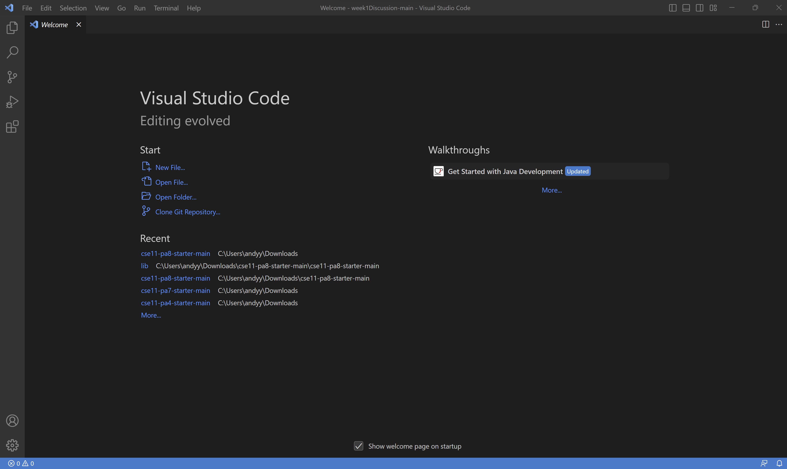
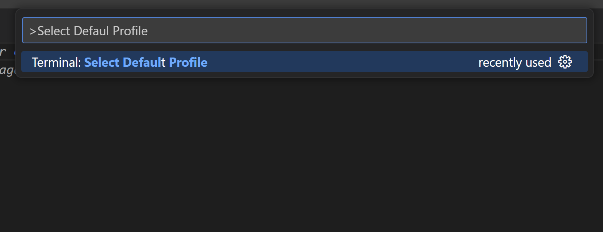
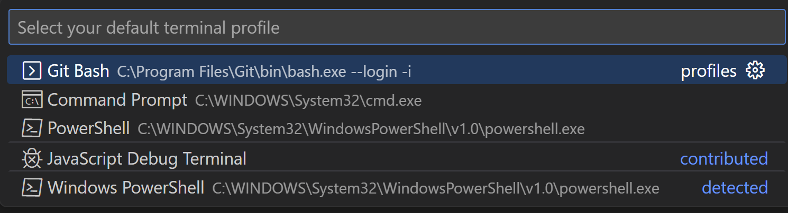
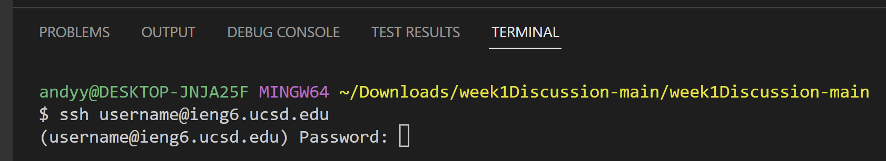
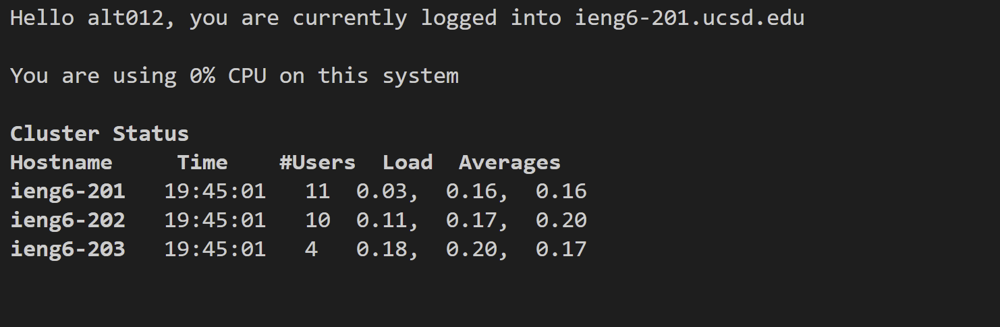

# Lab Report 1 - Remote Access and FileSystem

This page will give instructions on how to complete remote access, and some commands that can be used.

## Information/ Login
1. In order to complete remote access, you are required to have both your Tritonlink Username and Password, or CSE 15L Username and Password. For example's sake the former will be used.

## Installing VScode
1. The first step is to go to the following website: https://code.visualstudio.com/.
2. Using the given instructions, download VScode onto your system.
3. Upon viewing the following screen select **new file** (this will be used later).

## Obtaining & Using Git Bash
1. Visit the following: https://gitforwindows.org/, and download git onto your system.
2. After installation, switch back to your new file and use **CTRL + SHIFT + P**.
3. Type in **Select Default Profile**, use ENTER, and select **GitBash**.

4. Open the terminal by using **CTRL + `** or using **Terminal** then **New Terminal**.
5. In the terminal type **ssh** with a space, followed by your Tritonlink Username and the statement **@ieng6.ucsd.edu**.

6. After clicking **Enter** the terminal will prompt for a password, which should be your Tritonlink password.
>Hint: For some reason the hotbar won't display text; imagine that the text is still being shown to the computer and select **Enter**.
7. If the prompt *the authenticity of...* appears, type **yes**, **Enter**, and submit your password.
8. You will be successful in the remote connection if the following appears:

