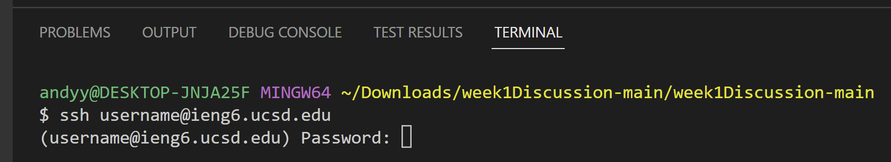
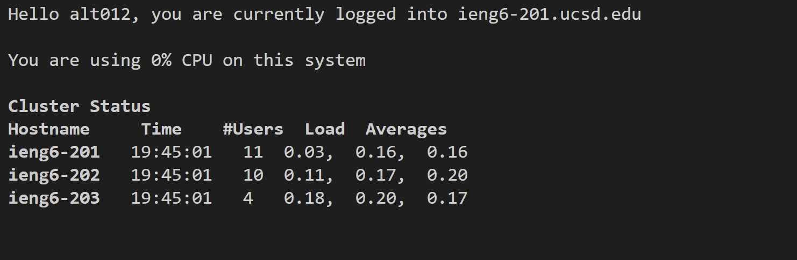

# Lab Report 1 - Remote Access and FileSystem

This page will give instructions on how to complete remote access, and some commands that can be used.

## Information/ Login
1. In order to complete remote access, you are required to have both your Tritonlink Username and Password, or CSE 15L Username and Password. For example's sake the former will be used.
2. The following steps will be provided, but you will also need to download VScode and Git Bash.

## If using CSE 15L Account
1. To start off, head to this link: https://sdacs.ucsd.edu/~icc/index.php and sign in using your Tritonlink Username, and Student PID (usually begins with an A and 9 digits)
2. Click the button below **Additional Accounts**, it should be your CSE Username and starts with *cs* (write this down for the next steps).
3. Select the link named **Global Password Change Tool**, and the next link **Proceed to the Password Change Tool**.
4. In the AD Password Change Tool, you'll want to enter your CSE Username from the previous button.
5. Select the phrase **I want to reset my course-specific account password**.
6. After completing the two-factor authentication, you'll be asked to use a link sent your email to complete the password reset process.
7. After the new password is authorized, the corresponding CSE Username and Password can be used for signing in remotely.

## Installing VScode
1. The first step is to go to the following website: https://code.visualstudio.com/. This will allow you to gain access to VScode.
2. Using the given instructions, download VScode onto your system. When its done downloading, open the file.
3. Upon viewing the following screen select **new file** (this will be used later).

## Obtaining & Using Git Bash
1. Visit the following: https://gitforwindows.org/, and download bash onto your system.
2. After installation, switch back to your new file and use **CTRL + SHIFT + P**.
3. Type in **Select Default Profile**, use **ENTER**, and select **GitBash**.

4. Open the terminal by using **CTRL + `** or using **Terminal** then **New Terminal**.
5. In the terminal type **ssh** with a space, followed by your Tritonlink Username and the statement **@ieng6.ucsd.edu**.
>If you're using your CSE Account information, use the corresponding information instead and the results may differ from the image.

6. After clicking **Enter** the terminal will prompt for a password, which should be your Tritonlink password/ CSE Account password.
>Hint: For some reason the hotbar won't display text; imagine that the text is still being shown to the computer and select **Enter**.
7. If the prompt *the authenticity of...* appears, type **yes**, **Enter**, and submit your password.
8. You will be successful in the remote connection if the following appears:

## Commands
Below is a list of some simple commands to experiment with in the terminal.
- cd
- ls
- pwd
- mkdir
- cp
- cd ~
- ls -lat
- ls -a

>Useful Commands:
>- clear (clears the terminal)
>- exit (exits the terminal)
