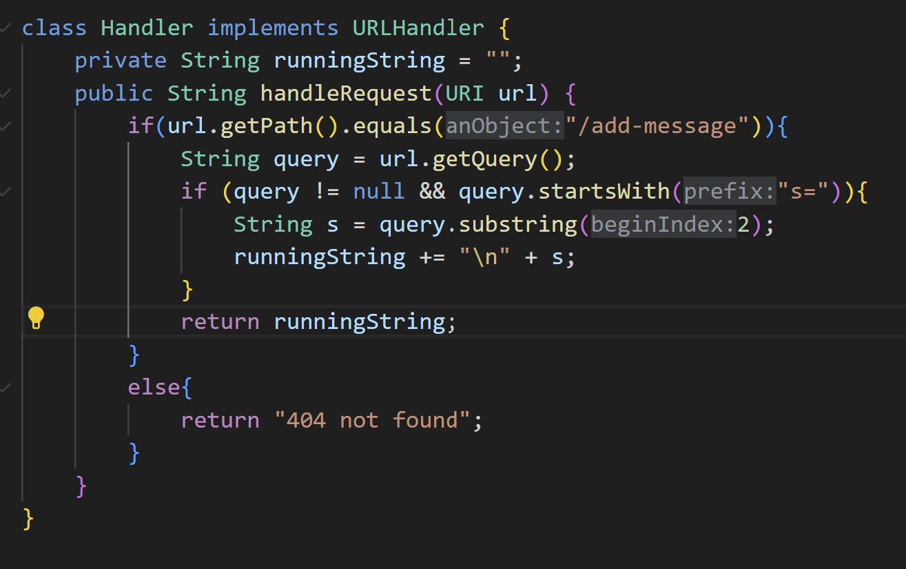
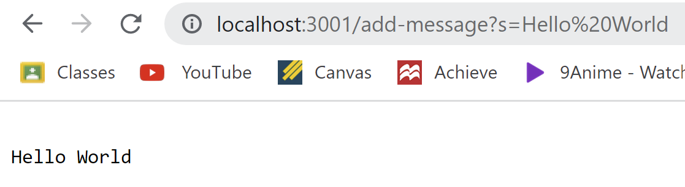
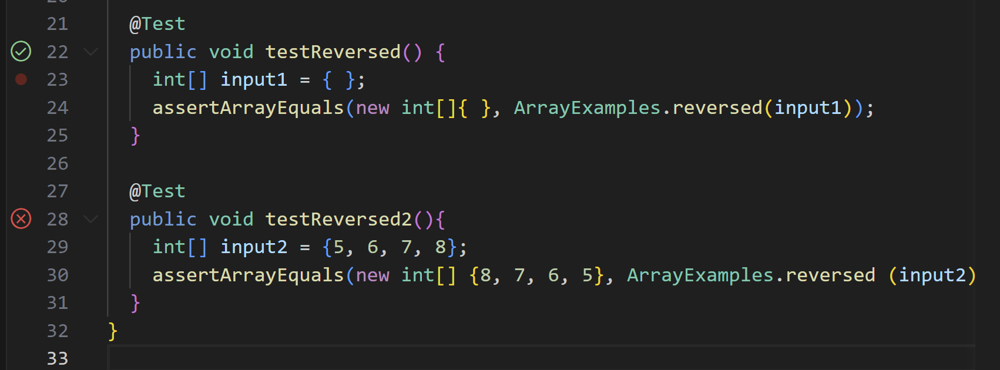

# Lab Report 2 - Servers and Bugs

## Part 1


Screenshot 1:

- **handleRequest** is called in which it takes in a given url to execute the following commands. **getPath** is used in conjunction with **.equals** to check if the **/add-message** string is present to continue the code body. **getQuery** is used to get the query of the given url. **startsWith** is used in the or statement to check if the query begins with **s=**, and **substring** produces the string after the **s=**.
- For **handleRequest**, **url** is the given local host in which the following commands will be centered around. **getPath** uses **.equals** to check if the specific string **/add-message** is contained in the url. **getQuery** is used to obtain the query, and checked with **startsWith** that has the value of **s=**. **subString** contains the index 2, to output the strings after **s=**. **subString** contains the index 2, to output the strings after **s=**.
- From this specific request, **url** contains the value of the local host url, **query** becomes s=Hello World, and s will contain the value of the substring after 2, Hello World. runningString is also updated to make a new line with Hello World.

Screenshot 2:

- **handleRequest** is called in which it takes in a given url to execute the following commands. **getPath** is used in conjunction with **.equals** to check if the **/add-message** string is present to continue the code body. **getQuery** is used to get the query of the given url. **startsWith** is used in the or statement to check if the query begins with **s=**, and **substring** produces the string after the **s=**. **runningString** as a variable is also utilized to create a new line with the aforementioned string.
- For **handleRequest**, **url** is the given local host in which the following commands will be centered around. **getPath** uses **.equals** to check if the specific string **/add-message** is contained in the url. **getQuery** is used to obtain the query, and checked with **startsWith** that has the value of **s=**. **subString** contains the index 2, to output the strings after **s=**.
- From this specific request, **url** contains the value of the local host url, **query** becomes s=Hello There!, and s will contain the value of the substring after 2, Hello There!. In this case another new line is created below Hello World, and Hello There! is placed below it.

## Part 2

Non-Failure Inducing Code:
```
public class ArrayTests{

  @Test
  public void testReversed() {
    int[] input1 = { };
    assertArrayEquals(new int[]{ }, ArrayExamples.reversed(input1));
  }
}
```

Failure Inudcing Code:
```
@Test
  public void testReversed2(){
    int[] input2 = {5, 6, 7, 8};
    assertArrayEquals(new int[] {8, 7, 6, 5}, ArrayExamples.reversed (input2));
  }
```
Results:


Before:
```
static int[] reversed(int[] arr) {
    int[] newArray = new int[arr.length];
    for(int i = 0; i < arr.length; i += 1) {
      arr[i] = newArray[arr.length - i - 1];
    }
    return arr;
  }
```

After:
```
static int[] reversed(int[] arr) {
    int[] newArray = new int[arr.length];
    for(int i = 0; i < arr.length; i += 1) {
      newArray[i] = arr[arr.length - i - 1];
    }
    return newArray;
  }
```
Explanation:
The bug present in this code was the method updating the original array (arr), and not the new array (newArray). To simply fix this, you switch the array being updated at the index of arr to the index of newArray and return newArray instead of arr. 

## Part 3
One important thing I didn't know before was the use of JUnit testing. I didn't know how to specifically create test cases using JUnit testing, because in CSE 8B Miranda, we were taught to use Tester T which is similar but not exactly the same. The lab taught me how to properly debug using it, and it will be very useful in my other coding classes. Another thing I learned was how to host a local website, which was a very interesting concept.
