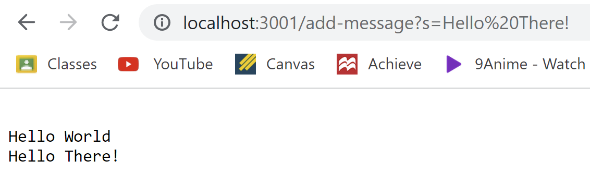

# Lab Report 2 - Servers and Bugs

## Part 1

- **handleRequest** is called in which it takes in a given url to execute the following commands. **getPath** is used in conjunction with **.equals** to check if the **/add-message** string is present to continue the code body. **getQuery** is used to get the query of the given url. **startsWith** is used in the or statement to check if the query begins with **s=**, and **substring** produces the string after the **s=**.

