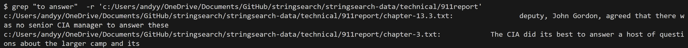
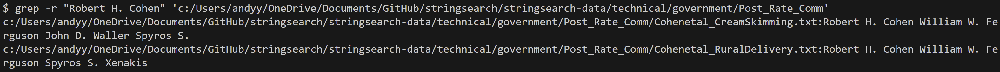
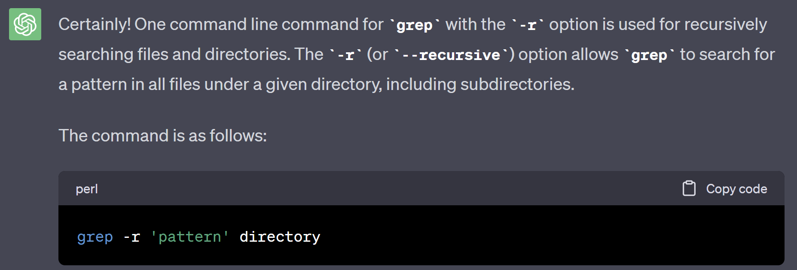
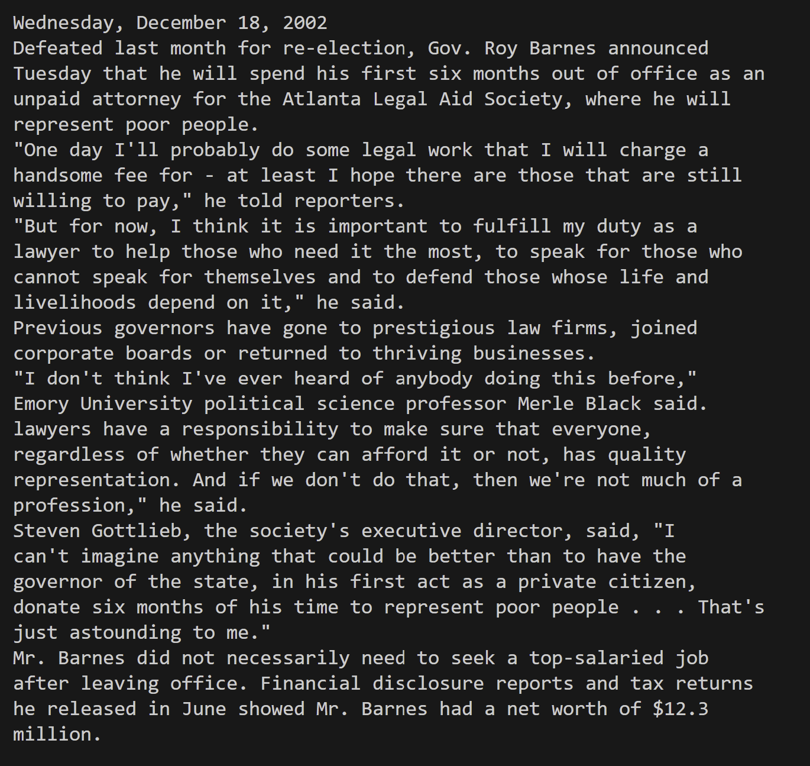
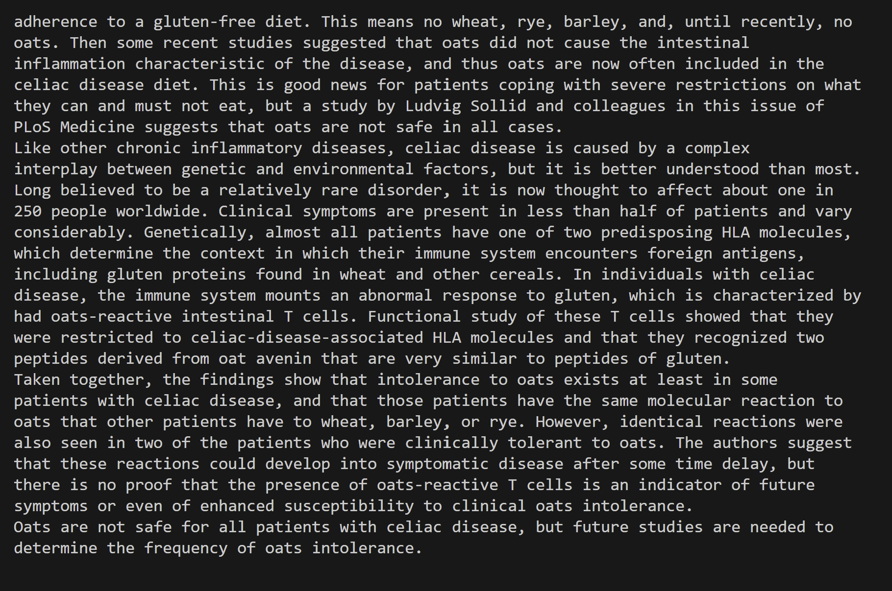
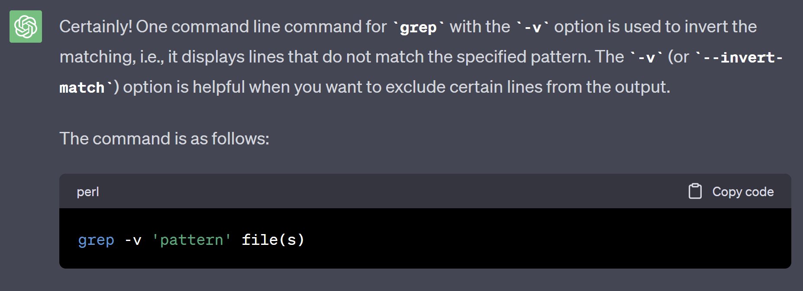
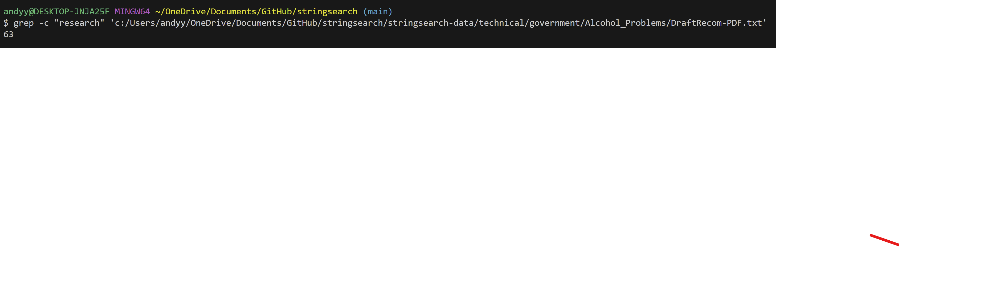
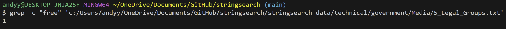

# Lab Report 3 - Researching Commands

## Researching Grep

# grep -r

`grep -r "to answer" c:/Users/andyy/OneDrive/Documents/GitHub/stringsearch/stringsearch-data/technical/911report
`

In this case, -r used with the grep command is recursively searching for all patterns of **to answer** in all files under the 911report directory. This is very useful if you're looking for a specific phrase or sentence that is repeated among many files under one directory.

`grep -r "Robert H.Cohen" c:/Users/andyy/OneDrive/Documents/GitHub/stringsearch/stringsearch-data/technical/government/Post_Rate_Comm `

In this case, -r used with grep searches recursively through all the files in the directory **Post_Rate_Comm** for any patterns of Robert H.Cohen. This is very useful for certain documents in which you're looking for a specific individual's name.

Sources: [Link Grep Commands](https://man7.org/linux/man-pages/man1/grep.1.html), ChatGPT

ChatGPT Prompt: "What is one command-line option for grep in bash?" 

ChatGPT Response: 

# grep -v

`grep -v "Barnes Volunteers as Lawyer to Poor" c:/Users/andyy/OneDrive/Documents/GitHub/stringsearch/stringsearch-data/technical/government/Media/Barnes_Volunteers.txt` 

In this case, -v is used with the grep command to return all strings in the document **Barnes_Volunteers.txt** that are not a part of the given pattern. This is very useful in smaller documents when trying to locate patterns unrelated to the one you're using as an input.

`grep -v "Most patients with celiac disease can eliminate their" c:/Users/andyy/OneDrive/Documents/GitHub/stringsearch/stringsearch-data/technical/plos/pmed.0010023.txt`

In this case, -v is used with grep to return all lines not included in the pattern specified. This is useful when looking through a document and want to exclude certain phrases or information.

Sources: [Link Grep Commands](https://man7.org/linux/man-pages/man1/grep.1.html), ChatGPT

ChatGPT Prompt: "What is another command-line option for grep in bash?" 

ChatGPT Response: 

# grep -i

Sources: [Link Grep Commands](https://man7.org/linux/man-pages/man1/grep.1.html)

# grep -c

`grep -c "research" 'c:/Users/andyy/OneDrive/Documents/GitHub/stringsearch/stringsearch-data/technical/government/Alcohol_problems/DraftRecom-PDF.txt'
`

In this case, -c is used to count the number of lines the pattern "research" appears. This is very useful when trying to narrow down the number of lines in which your pattern appears.

`grep -c "free" 'c:/Users/andyy/OneDrive/Documents/GitHub/stringsearch/stringsearch-data/technical/government/Media/5_Legal_Groups.txt'
`

 

In this case, -c is used to count the number of lines the pattern "free" appears on the text document "5_Legal_Groups.txt".
Sources: [Link Grep Commands](https://man7.org/linux/man-pages/man1/grep.1.html)
