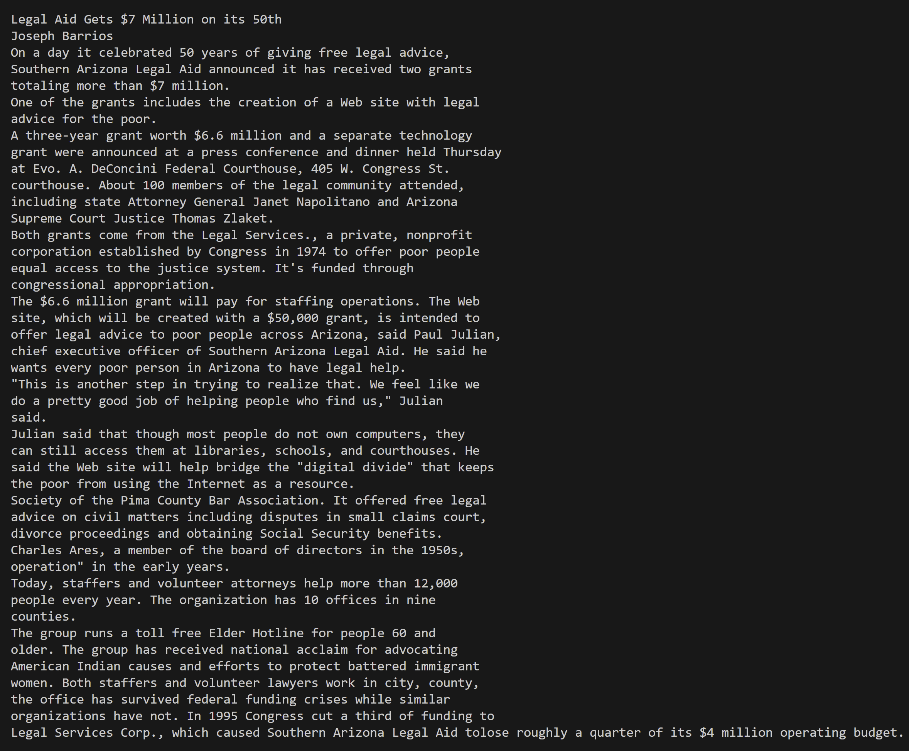

# Lab Report 3 - Researching Commands

## Researching Find

grep -r

`grep "to answer" -r c:/Users/andyy/OneDrive/Documents/GitHub/stringsearch/stringsearch-data/technical/911report
`

In this case, -r used with the grep command is recursively searching for all patterns of **to answer** in all files under the 911report directory. This is very useful if you're looking for a specific phrase or sentence that is repeated among many files under one directory.

grep -v

`grep -v "Legal Aid Gets $7 Million on its 50th Joseph Barrwas" c:/Users/andyy/OneDrive/Documents/GitHub/stringsearch/stringsearch-data/technical/government/Media/Aid_Gets_7_Million.txt
`

