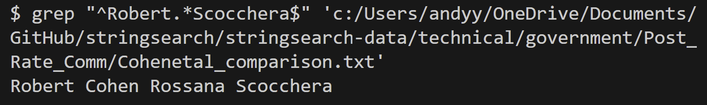
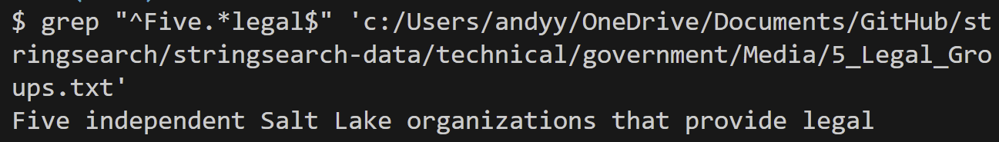

# Lab Report 3 - Researching Commands

## Researching Grep

# grep -r

`grep -r "to answer" c:/Users/andyy/OneDrive/Documents/GitHub/stringsearch/stringsearch-data/technical/911report
`

In this case, -r used with the grep command is recursively searching for all patterns of **to answer** in all files under the 911report directory. This is very useful if you're looking for a specific phrase or sentence that is repeated among many files under one directory.

`grep -r "Robert H.Cohen" c:/Users/andyy/OneDrive/Documents/GitHub/stringsearch/stringsearch-data/technical/government/Post_Rate_Comm `

In this case, -r used with grep searches recursively through all the files in the directory **Post_Rate_Comm** for any patterns of Robert H.Cohen. This is very useful for certain documents in which you're looking for a specific individual's name.

# grep -v

`grep -v "Barnes Volunteers as Lawyer to Poor" c:/Users/andyy/OneDrive/Documents/GitHub/stringsearch/stringsearch-data/technical/government/Media/Barnes_Volunteers.txt` 

In this case, -v is used with the grep command to return all strings in the document **Barnes_Volunteers.txt** that are not a part of the given pattern. This is very useful in smaller documents when trying to locate patterns unrelated to the one you're using as an input.

`grep -v "Most patients with celiac disease can eliminate their" c:/Users/andyy/OneDrive/Documents/GitHub/stringsearch/stringsearch-data/technical/plos/pmed.0010023.txt`

In this case, -v is used with grep to return all lines not included in the pattern specified. This is useful when looking through a document and want to exclude certain phrases or information.

# grep start & end

`grep "^Robert.*Scocchera$" c:/Users/andyy/OneDrive/Documents/GitHub/stringsearch/stringsearch-data/technical/government/Post_Rate_Comm/Cohenetal_comparison.txt`

In this case, using the format above you can search through a file for lines that start with **start** and end with **end**. This can be very useful when trying to search for specific lines or formats within a text.

`grep "^Five.*legal$" c:/Users/andyy/OneDrive/Documents/GitHub/stringsearch/stringsearch-data/technical/government/Media/5_Legal_Groups.txt`

In this case, we're searching for a line in the **5_Legal_Groups.txt** that starts with **Five** and ends with **legal**. This can be useful is loooking for a specific line within a text document.

