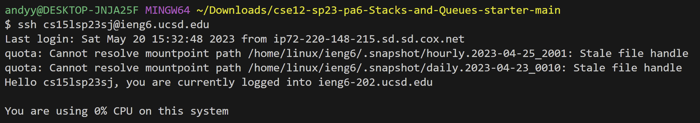
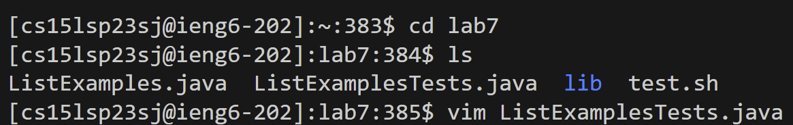
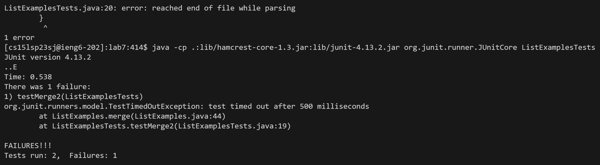
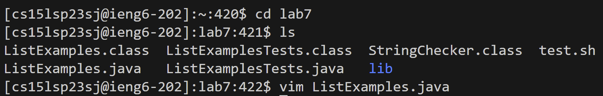
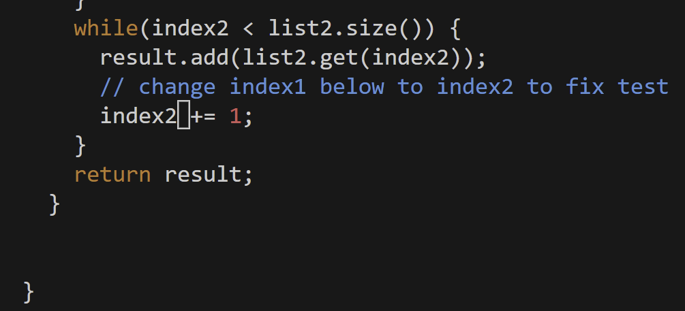
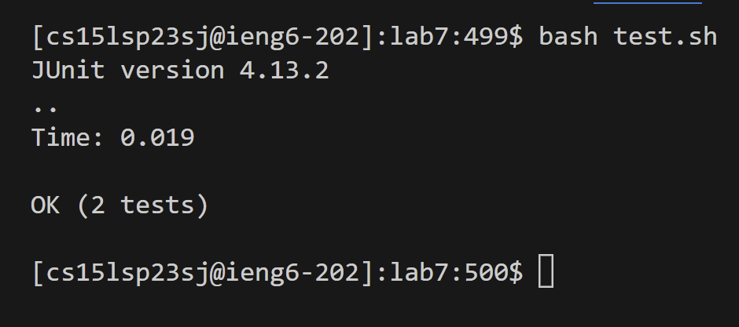
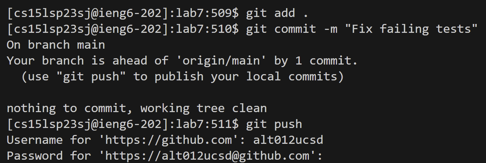

# Lab Report 4 

Step 4:

I typed my remote access login information, followed by `<enter>` to establish remote connection.
  
Step 5:
  

I then used the git clone command followed by the url of the repository I was forking, finished with `<enter>`.

Step 6:

I ran the following tests in the `test.sh` file, which yielded some errors.
`javac -cp .:lib/hamcrest-core-1.3.jar:lib/junit-4.13.2.jar *.java`
`java -cp .:lib/hamcrest-core-1.3.jar:lib/junit-4.13.2.jar org.junit.runner.JUnitCore ListExamplesTests`

Step 7:

I then used the change directory command to change into lab7's directory, followed by looking for the ListExamples.java which held the corresponding code. I then activated vim with the corresponding file.

Keys pressed: `<up> * 5 | <left> * 12 | i | <backspace> | 2 | <esc> | :w | :q |`
I navigated to the line `index1+=1`, then entered insert mode. I then deleted the 1, inputted the 2, used esc, and saved while exiting vim.

Step 8:

I used `bash test.sh` to run the testers. I passed both of them, leaving me to conclude I made the corrections and the code is working properly now.

Step 9:

I then used git add and commit with the following message "Fix failing tests" to push my changes to my github page.

  
  
  
  
  
