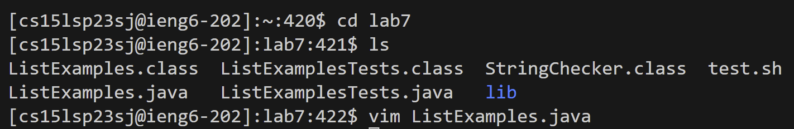

# Lab Report 4 

Step 4:

I typed my remote access login information, followed by `<enter>` to establish remote connection.
  
Step 5:
  

I then used the git clone command followed by the url of the repository I was forking, finished with `<enter>`.

I then used the change directory command to enter lab7 followed by `<enter>`, then used the list command to view the files inside the directory `<enter>`. I then started vim on the ListExamplesTests.java file `<enter>`.

Step 6:

Keys Pressed: 
  
  
  
  
  
