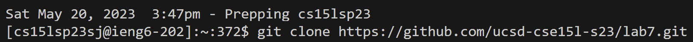

# Lab Report 4 

Step 4:

I typed my remote access login information, followed by `<enter>` to establish remote connection.
  
Step 5:
  

I then used the git clone command followed by the url of the repository I was forking, finished with `<enter>`.

Step 6:

I ran the following tests in the `test.sh` file, which yielded some errors.

Step 7:

I then used the change directory command to change into lab7's directory, followed by looking for the ListExamplesTests.java which held the JUnit tests. I then activated vim with the corresponding file.

  
  
  
  
  
