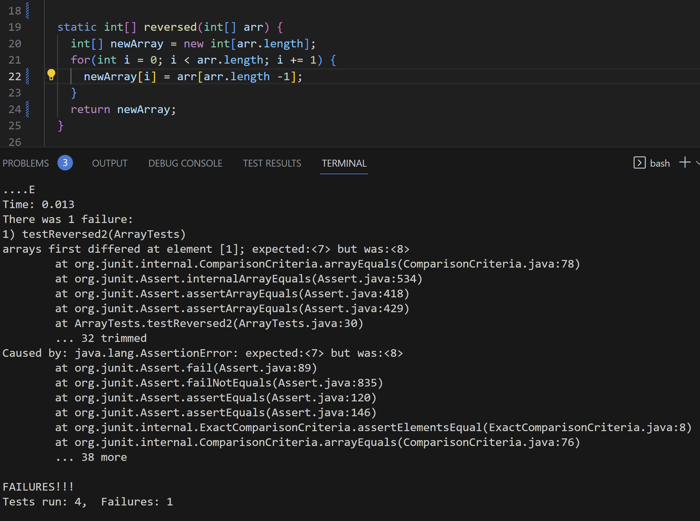
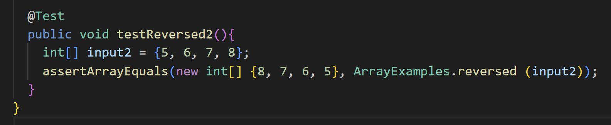
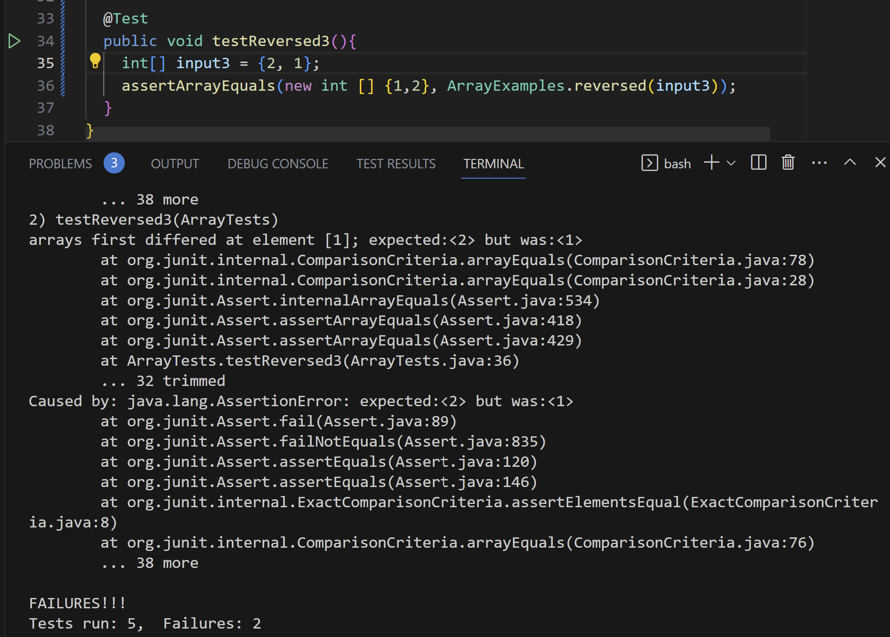

# Lab Report 5

## Part 1 - Debugging Scenario
1.) Student Post:

I'm having a problem with the following method, that its supposed to reverse an array of integers. When I created a test case using the array `[8, 7, 6, 5]`, it should've produced `[5, 6, 7, 8]` but instead the element 7 was instead 8. I'm not entirely sure what the issue is, but if I had to make a guess it would have to be in the for loop. 

2.) TA Response:

Try creating another test, in which you test the reverse method against an array of only two elements. For example `{1,2}`, to see if the values are being updated correctly or not. Additionally, narrowing down the array to two values allows you to better catch what the issue may be.

3.) Sudent Response:

I've noticed that in an array of two values, neither the first or second index were changed. This led me to conclude the values are not being updated correctly or at all. By analyzing my for loop i noticed I needed to add `i` into the equation to allow the for loop to carry out its intended purpose. `newArray[i] = arr[arr.length -i - 1` was my modification.

4.) Setup

- I used the files `ArrayExamples.java` and `ArrayTests.java` in the `lab3` directory. These were files included with Lab 3.

Contents Before the Changes:

## Part 2 - Reflection
